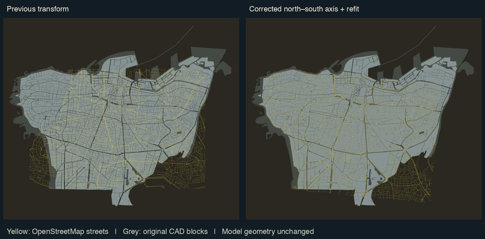

# Beirut registration correction

The main geographic error was a missing north–south reflection in the model-to-map transform. The browser stores Rhino points as `(X, Z, -Y)`. The old registration treated browser +Z as north; independently mapped streets favor -Z as north for this model.

The correction changes geographic mapping, map labels, and imagery association. The city meshes, collision geometry, and existing image files remain unchanged.

## Accepted mapping

The source of truth is [`public/data/registration.json`](../public/data/registration.json). In the local tangent plane anchored at 33.888° N, 35.495° E:

```text
[east, north] = scale × R(angle) × [modelX, -modelZ] + [eastOffset, northOffset]
angle        = -0.0343390319 degrees
scale        =  1.0007898129
eastOffset   = 1259.907077 m
northOffset  = -142.652134 m
```

`src/game/georeference.js` supplies the runtime forward/inverse transforms and geographic north vector. The location-data builder reads the same canonical file, so road polylines, neighborhood labels, compass, full map, and Google Maps links use one mapping.

The prior “75–104 m” figures were coast/river proxy-fit residuals. They were not per-building position errors. Comparing the two transforms across all building centres gives a **1,635 m median displacement**, with a **4,934 m maximum**; the old sign error was much larger than a uniform 100 m offset.

## Validation and its limits

The fit uses OSM streets and the CAD block/street layout. Entire OSM ways with ID modulo 5 equal to zero are withheld from fitting. Both mappings were evaluated on the same 6,607 held-out samples:

| Street/block consistency check | Old mapping | Corrected mapping |
| --- | ---: | ---: |
| Samples more than 2.5 m inside a modeled block | 67.55% | 21.99% |
| 90th percentile distance inside a modeled block | 34.52 m | 4.39 m |

This measures how often mapped streets cross modeled blocks. **It is not a 4.39 m building-position accuracy claim.** Narrow roads, sidewalks, model age, and missing internal streets affect the metric. The raster resolution is 2.5 m.



Yellow lines are independently mapped OSM streets; grey regions are original CAD blocks. Source: © OpenStreetMap contributors and the supplied model.

Roof outlines were also inspected against cached, georeferenced z19 satellite pixels in four separated areas. These checks support the global registration and reveal remaining roof lean/parallax, changed buildings, and model simplification. The local diagnostic is `data/registration-v2/roof-validation.jpg`; one eastern patch has one missing cached tile. No survey-grade or per-facade accuracy is claimed, and `accuracyMeters` stays null.

## Reusing the photo cache

`scripts/reassociate_imagery.py` produces these separate outputs without overwriting legacy imagery or making network requests:

- `data/registration-v2/buildings_geo.json`: corrected targets for all 17,575 buildings.
- `data/registration-v2/photo-candidates.json`: up to three cached images per building, ranked by proximity and horizontal framing.
- `data/registration-v2/rejected-photos.json`: 22 implausible original camera associations excluded from reuse.
- `data/registration-v2/summary.json`: coverage and displacement metrics.

There are **9,586 buildings** with at least one candidate image whose camera is within 80 m and whose stored heading differs by at most 40° from the new target bearing. At a stricter 60 m distance and 15° bearing difference, **5,401 buildings** have a candidate.

These are candidates, not texture-ready matches. Before projection, each selected image still needs a visible-facade/occlusion check, camera height/pitch/FOV calibration, and perspective rectification. A fixed 640 × 640 image cannot reveal a facade outside its saved view. Some views can be reused directly; others need another rendering from a saved panorama or new coverage.

Legacy image filenames must not be treated as correct model-building identities. Keep original camera sidecars, requested-target coordinates, and panorama IDs for provenance. Google confirms that a requested location can snap to a different panorama position: [Street View metadata](https://developers.google.com/maps/documentation/streetview/metadata).

## Reproduce

The geometry audit uses existing `.cache/tiles/*.raw` and cached OSM responses:

```sh
uv venv .cache/registration-venv
uv pip install --python .cache/registration-venv/bin/python -r requirements-registration.txt
.cache/registration-venv/bin/python scripts/audit_registration.py
```

Add `--fit` to rerun the reflected similarity search. The script only writes diagnostics; it does not overwrite the accepted registration.

```sh
python3 scripts/build_city_locations.py
.cache/registration-venv/bin/python scripts/reassociate_imagery.py
npm test
```

The old scripts under `.cache/geo_extract` are historical and should not regenerate current targets. Besides the sign issue, their finalizers contain a mixed-column centre-indexing bug. The old saved target list itself has correctly computed model centres; its geographic transform is the obsolete part.
